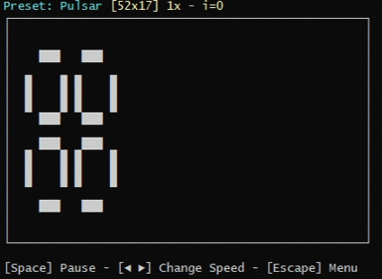

# Conways Game of CLIfe

  

## Info:
Conway's Game of Life in the Command Line Interface.  
Features a bunch of premade presets, a random generator and an editor to create your own presets.  
I strongly recommend using CMD, Git Bash or zsh to run this since it renders better than other terminal apps.  

### This game is part of my [CLI Games Collection](https://github.com/Sv443/CLI-Games-Collection)
### You can download a standalone version here: 

 

## Steps to build:
1. Have Node.js and npm installed (I recommend the latest v14)
2. Download or clone the repo and open a terminal in the downloaded folder
3. Install dependencies by running the command `npm i` in the terminal
4. Run the command `npm run build` to build the executables (they will be located in the `dist` folder)

 

## Rules of Conway's game of life:
| &nbsp; | &nbsp; |
| --- | --- |
| Births | Each dead cell adjacent to exactly three live neighbors will become live in the next generation. |
| Death by isolation | Each live cell with one or fewer live neighbors will die in the next generation. |
| Death by overcrowding | Each live cell with four or more live neighbors will die in the next generation. |
| Survival | Each live cell with either two or three live neighbors will remain alive for the next generation. |

 

## Dependencies:
- [fs-extra](https://npmjs.com/package/fs-extra)
- [keypress](https://npmjs.com/package/keypress)
- [perlin-noise](https://npmjs.com/package/perlin-noise)
- [svjsl](https://npmjs.com/package/svjsl)
- [unzipper](https://npmjs.com/package/unzipper)
